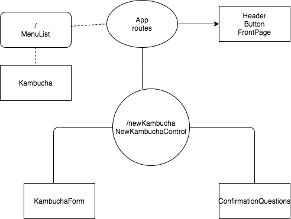

# _Kumbucha_

#### _React Webapplication. 2.6.2020_

#### By _** Jamila Aliyeva**_

## Description

_The user is loaded onto a localhost webpage where they are presented with a menu, a navigationbar and buttons.If the user clicks on the buttons in the navigation bar he or she is redirected to a form where he or she would fill out an order._

## Setup/Installation Requirements

### `npm install`
### `npm start`

## Known Bugs

_No known major bugs at this time._

## Support and contact details

_aliyeva852@gmail.com_

## Technologies Used

_Javascript, React, Material UI, Webpack, ESLint_

### License

*The MIT license*

Copyright (c) 2020 **_ Jamila Aliyeva_**

Permission is hereby granted, free of charge, 
to any person obtaining a copy of this software and 
associated documentation files (the "Software"), to 
deal in the Software without restriction, including 
without limitation the rights to use, copy, modify, 
merge, publish, distribute, sublicense, and/or sell 
copies of the Software, and to permit persons to whom 
the Software is furnished to do so, 
subject to the following conditions:

The above copyright notice and this permission notice 
shall be included in all copies or substantial portions of the Software.

THE SOFTWARE IS PROVIDED "AS IS", WITHOUT WARRANTY OF ANY KIND, 
EXPRESS OR IMPLIED, INCLUDING BUT NOT LIMITED TO THE WARRANTIES 
OF MERCHANTABILITY, FITNESS FOR A PARTICULAR PURPOSE AND NONINFRINGEMENT. 
IN NO EVENT SHALL THE AUTHORS OR COPYRIGHT HOLDERS BE LIABLE FOR 
ANY CLAIM, DAMAGES OR OTHER LIABILITY, WHETHER IN AN ACTION OF CONTRACT, 
TORT OR OTHERWISE, ARISING FROM, OUT OF OR IN CONNECTION WITH THE 
SOFTWARE OR THE USE OR OTHER DEALINGS IN THE SOFTWARE.
 

